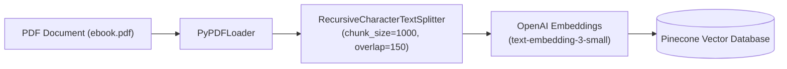
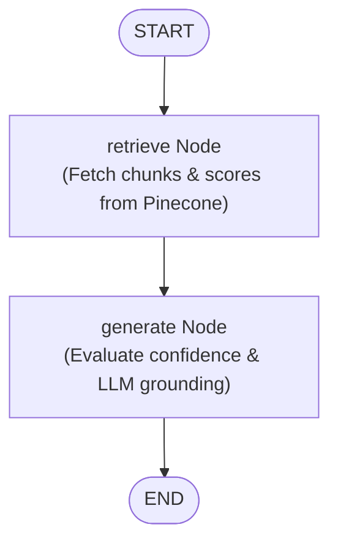

# Agentic AI eBook RAG Chatbot

A production-quality Retrieval-Augmented Generation (RAG) AI Chatbot orchestrated with **LangGraph**, **Pinecone**, **OpenAI Embeddings & LLM**, and **FastAPI**.

This chatbot strictly answers questions based **ONLY** on the provided **Agentic AI eBook**. If an answer is not present in the eBook, it strictly enforces grounding rules and responds with:

> `"I couldn't find enough information in the provided Agentic AI eBook."`

---

## 📌 Architecture & Workflow

### 1. Ingestion Pipeline


### 2. LangGraph Query Workflow


---

## 📂 Project Structure

```
.
├── app/
│   ├── __init__.py         # Package initialization
│   ├── config.py           # Pydantic settings & environment configuration
│   ├── schemas.py          # API request/response models & LangGraph state schema
│   ├── vector_store.py     # Pinecone vector search & score calculation logic
│   ├── graph.py            # LangGraph workflow orchestration (START -> retrieve -> generate -> END)
│   └── main.py             # FastAPI REST API endpoints
├── tests/
│   ├── __init__.py
│   ├── test_api.py         # FastAPI endpoint integration tests
│   ├── test_graph.py       # LangGraph state transition unit tests
│   └── test_grounding.py   # Grounding rules & benchmark question tests
├── .env.example            # Environment variables template
├── .gitignore              # Git ignore file
├── ebook.pdf               # Downloaded Agentic AI eBook knowledge source
├── ingest.py               # Document ingestion CLI script
├── requirements.txt        # Python dependency specifications
└── README.md               # Project documentation
```

---

## ⚙️ Environment & Setup

### Prerequisites
- Python 3.10+
- OpenAI API Key
- Pinecone API Key

### Installation

1. **Clone Repository & Navigate to Folder**:
   ```bash
   git clone <your-repo-url>
   cd rag
   ```

2. **Create Virtual Environment**:
   ```bash
   python -m venv venv
   # On Windows:
   .\venv\Scripts\activate
   # On macOS/Linux:
   source venv/bin/activate
   ```

3. **Install Dependencies**:
   ```bash
   pip install -r requirements.txt
   ```

4. **Configure Environment Variables**:
   Copy `.env.example` to `.env` and populate your API credentials:
   ```bash
   cp .env.example .env
   ```
   Edit `.env`:
   ```env
   OPENAI_API_KEY=sk-...
   PINECONE_API_KEY=pcsk_...
   PINECONE_INDEX_NAME=agentic-ai-ebook
   TOP_K_RESULTS=4
   SIMILARITY_THRESHOLD=0.35
   ```

---

## 🚀 Data Ingestion

To process `ebook.pdf`, split text into chunks, generate embeddings, and store them in Pinecone:

```bash
python ingest.py ebook.pdf
```

Output:
- PDF page extraction using `PyPDFLoader`
- Text chunking using `RecursiveCharacterTextSplitter` (1000 chars, 150 overlap)
- Creation of Pinecone index (`agentic-ai-ebook`, dimension 1536, metric `cosine`)
- Batch upsert of vector embeddings into Pinecone

---

## 📡 Running the FastAPI Service

Start the FastAPI application server:

```bash
uvicorn app.main:app --host 0.0.0.0 --port 8000 --reload
```

Interactive API documentation available at:
- Swagger UI: `http://localhost:8000/docs`
- ReDoc: `http://localhost:8000/redoc`

---

## 💬 API Reference

### `POST /chat`

Submit a question to the RAG chatbot.

#### Request Body
```json
{
  "query": "What is Agentic AI according to the eBook?"
}
```

#### Response Body (Supported Query)
```json
{
  "answer": "According to the eBook, Agentic AI refers to autonomous AI systems that use large language models as core orchestrators to pursue multi-step goals using tools, memory, and reflection.",
  "retrieved_chunks": [
    "Agentic AI systems extend traditional LLM capabilities by enabling proactive decision-making..."
  ],
  "confidence_score": 0.8421
}
```

#### Response Body (Unsupported / Unrelated Query e.g. FIFA World Cup)
```json
{
  "answer": "I couldn't find enough information in the provided Agentic AI eBook.",
  "retrieved_chunks": [],
  "confidence_score": 0.0
}
```

---

## 🧪 Testing & Validation

Run the automated test suite powered by `pytest`:

```bash
pytest -v
```

### Benchmark Grounding Tests Include:
1. **Supported Questions**: Verifies retrieval and grounded LLM answers.
2. **Unrelated General Knowledge Questions**: Verifies that off-topic questions (e.g., *"Who won the 2022 FIFA World Cup?"*) strictly trigger the exact fallback string:
   `"I couldn't find enough information in the provided Agentic AI eBook."`
3. **API Contract Validation**: Tests schema compliance, confidence score calculations, and status codes.

---

## 🛡️ Key Features & Grounding Rules

- **Zero Hallucination**: Temperature is locked at `0.0`. Strict system prompts prevent fallback to external/general knowledge.
- **Dynamic Confidence Scoring**: Calculated directly from retrieval evidence (similarity score of retrieved chunks).
- **Fallback Enforcement**: If top-k vector similarity is below the configured threshold or if no context matches, the system immediately returns the exact required fallback message without inventing facts.
